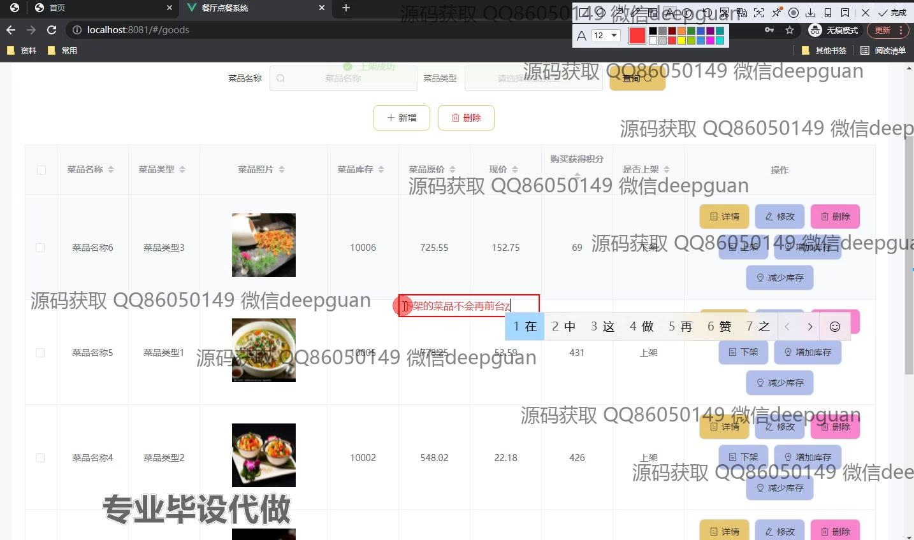
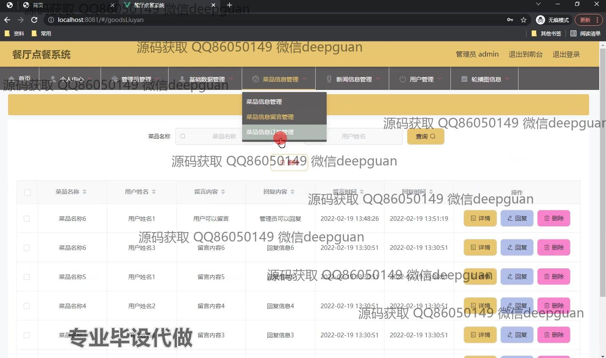

<h1 align="center">餐厅点餐系统的设计与实现+vue</h1>

## 简介
餐厅点餐系统：角色分为管理员、用户；功能包括菜品管理、订单管理、用户管理、购物车、留言管理、充值支付，支持增删改查及上下架操作。    --计算机毕业设计源码；毕设源码；java毕业设计源码

## 联系方式

<h3 align="center">获取完整代码与数据库文件 + 微信：deepguan QQ: 86050149 QQ群: 783742310</h3>

<h3 align="center">可帮忙远程部署 包运行成功！提供远程部署、修改代码、设计文档指导、代码讲解等服务！</h3>

## 功能介绍（完整见运行截图）
管理员：基本功能包括登录、注册、退出和权限管理；网站首页提供主导航栏、欢迎标语和系统提示信息；后台管理功能模块包括菜品管理（查询、详情、修改、删除、库存调整、上下架等）、订单管理（订单查询、删除、状态修改）、用户管理（用户信息查询、添加、修改、删除），支持数据分页与表单操作；菜品留言管理允许管理员查看、回复和删除用户留言。

用户：支持登录、注册、退出等基础功能；网站首页提供导航栏、轮播图、菜品推荐和新闻展示；商品模块支持菜品查询、详情查看、数量选择、购物车管理和模拟在线支付；留言功能允许用户对菜品进行评论和查看回复；个人中心模块提供信息修改、订单查询和充值操作，支持选择多种支付方式完成账户充值。

## 运行截图

本代码来源于网络,仅供学习参考使用!

